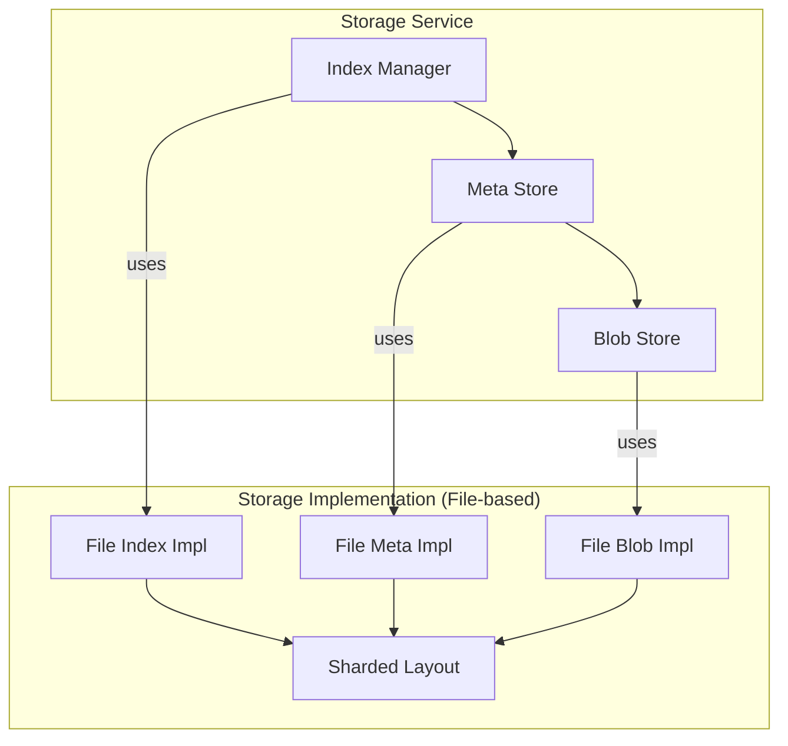

# Go 存储系统设计文档

## 1. 概述

本文档描述了一个基于 Go 的文件存储系统设计，该系统采用模块化设计以支持高性能和未来扩展，并提供了一个兼容 `fs.FS` 的接口。
## 2. 设计目标

- 兼容 Go 的 `fs.FS` 接口
- 模块化设计，易于维护和扩展
- 高性能存储和检索
- 支持文件元数据管理和版本兼容
- 支持文件路径索引和内容寻址

## 3. 架构设计

系统分为四个核心模块：**Index**, **Meta**, **Blob**, **Content**，以及一个通用的 **Layout** 模块。

> 注： 上图展示了模块间的逻辑关系和实现依赖。读取文件时的主要数据流为 Index -> Meta -> Blob。当采用基于文件的后端实现时，所有上层模块都将依赖于一个通用的 Sharded Layout 模块来处理物理文件存储。 +> 注： 上图展示了模块间的逻辑关系和实现依赖。Storage Service 是面向用户的最高层服务，它编排 Index 和 Meta 服务。Meta Service 负责核心的文件内容处理逻辑，它依赖底层的 Meta Store 和 Blob Store 进行持久化。

### 3.1 模块职责

#### 3.1.1 Blob 模块
- **职责**: 负责原始二进制数据块（Chunks）的存储与检索。
- **核心功能**: 提供基于内容哈希（ID）的数据块 `Read`, `Write`, `Delete`, `Exists` 接口。
- **关注点**: 数据块的完整性、去重和存储效率。

#### 3.1.2 Meta 模块
- **职责**: 负责文件内容级别的元数据（`FileMeta`）管理。
- **核心功能**: 提供基于内容哈希（ID）的 `FileMeta` 对象的 `CRUD` 接口。`FileMeta` 包含文件大小、修改时间、数据块哈希列表、引用计数等信息。
- **关注点**: 文件的版本管理、小文件优化（嵌入）、大文件分块逻辑。此模块内部分为两层： 
- meta.Service (高层服务)
   • 职责: 负责文件内容级别的业务逻辑编排。
   • 核心功能: 处理 io.Reader 数据流，进行分块、计算内容哈希ID、调用 Blob 模块存储数据块，并最终调用 meta.Store 持久化元数据。
   • 关注点: 文件的版本管理、小文件优化（嵌入）、大文件分块逻辑、内容ID的生成。 
  - meta.Store (底层存储)
   • 职责: 负责 FileMeta 对象的持久化。
   • 核心功能: 提供基于ID的 FileMeta 对象的 CRUD 接口。
   • 关注点: 序列化/反序列化元数据，与物理存储（如 Sharded Layout）交互。

#### 3.1.3 Index 模块
- **职责**: 负责文件系统的目录结构和命名空间管理。
- **核心数据模型**: `Node`。一个 `Node` 代表文件系统中的一个对象（文件、目录、符号链接等）。它通过 `ParentID` 链接形成目录树，并通过 `MetaHash` 指向 `Meta` 模块中的 `FileMeta`。
- **核心功能**: 提供对 `Node` 的 `CRUD` 操作，以及高效的目录遍历、路径解析和移动/重命名功能。
- **关注点**: 目录结构的事务一致性、高性能的目录操作。

#### 3.1.4 Sharded Layout 模块 (通用抽象层)
- **职责**: 抽象和封装将数据根据 ID 存储到物理文件系统的通用逻辑。
- **核心功能**: 提供 `Read`, `Write`, `Delete`, `Exists` 接口，内部处理 `ID -> xx/yy/ID` 的路径转换和目录创建。
- **关注点**: 避免代码重复，为 `Blob`、`Meta`、`Index` 的文件实现提供统一、可维护的底层存储布局。

### 3.1.5 Content 模块 (新增)
- **职责**: 扮演“组装者”的角色。根据 `Meta` 模块提供的文件元数据，从 `Blob` 模块中获取一个或多个数据块，并将它们组装成一个对用户透明的、连续的 `io.Reader` 数据流。
- **核心功能**: 提供 `NewReader` 接口，输入 `FileMeta`，输出 `io.Reader`。
- **关注点**: 解耦 `Meta` 和 `Blob` 的直接依赖，封装内容读取的复杂性（如处理内嵌数据和分片数据）。

## 4. 接口设计

所有接口定义位于 `runtime/interfaces` 包中。

### 4.1 核心接口

```go
// Storage 核心接口，兼容 fs.FS
type Storage interface {
    fs.FS
    fs.ReadDirFS
    fs.StatFS
    
    // 扩展接口
    Write(name string, data []byte) error
    Remove(name string) error
    Mkdir(name string) error
}
```

### 4.2 元数据存储接口 (`metaiface.Store`)

```go
type Store interface {
    Write(data []byte) (string, error)
    Read(id string) ([]byte, error)
    Delete(id string) error
    Exists(id string) (bool, error)
}
```

### 4.3 文件元数据接口 (metaiface.FileMeta)
(接口定义保持不变)
```go
type MetaStore interface {
    Create(meta FileMeta) (string, error)
    Get(id string, targetVersion int) (FileMeta, error)
    Update(id string, meta FileMeta) error
    Delete(id string) error
    // ... 其他方法 ...
}
```

### 4.4 Meta 存储接口

```go
// IndexManager defines the interface for managing the file system's namespace and structure.
type Manager interface {
    // CreateNode creates a new node in the index.
    CreateNode(node *Node) error

    // GetNode retrieves a node by its unique ID.
    GetNode(nodeID string) (*Node, error)

    // GetNodeByPath retrieves a node by its full path.
    GetNodeByPath(path string) (*Node, error)

    // UpdateNode updates an existing node's data.
    // This is used for operations like chmod, chown, or rename.
    UpdateNode(node *Node) error

    // DeleteNode removes a node from the index.
    // It should fail if trying to delete a non-empty directory.
    DeleteNode(nodeID string) error

    // ListChildren retrieves all immediate children of a directory node.
    ListChildren(parentID string) ([]*Node, error)
    
    // MoveNode moves a node to a new parent directory and/or new name.
    MoveNode(nodeID string, newParentID string, newName string) error
}

// Node represents a single entry in the file system index.
type Node struct {
    NodeID      string      // Unique identifier for this node (e.g., a UUID).
    ParentID    string      // NodeID of the parent directory.
    Name        string      // Name of the node within its parent directory.
    NodeType    NodeType    // Type of the node (File, Directory, etc.).
    Mode        fs.FileMode // Permissions and mode bits.
    // ... other metadata like Owner, Timestamps ...

    // MetaHash is the hash/ID of the FileMeta object in the Meta Store.
    // Only applicable for NodeType = File.
    MetaHash    string      `json:"meta_hash,omitempty"`
}

type NodeType int
const (
    File NodeType = iota
    Directory
    Symlink
)
```

### 4.5 Sharded Layout 接口 (新设计)

```go
// ShardedStorage defines a generic interface for storing data in a sharded
// directory structure based on an ID.
type ShardedStorage interface {
    Write(id string, data []byte) error
    Read(id string) ([]byte, error)
    Exists(id string) (bool, error)
    Delete(id string) error
    GetPath(id string) (string, error)
}
```

### 4.6 Content Assembler 接口 (新设计)

```go
// Assembler is responsible for assembling file content from metadata and blob storage.
package content

import (
    "io"
    "github.com/your-repo/project/interfaces/storage/meta"
    "github.com/your-repo/project/interfaces/storage/blob"
)

type Assembler interface {
    // NewReader creates an io.Reader for the given FileMeta.
    // It uses the blobStore to fetch data chunks if necessary.
    NewReader(fileMeta meta.FileMeta, blobStore blob.Store) (io.Reader, error)
}
```

## 5. 实现方案

### 5.1 Blob 存储实现选项

1. **本地文件系统实现**
    - 简单直接
    - 适合小型系统

2. **分布式存储实现**
    - 支持 S3/MinIO 等对象存储
    - 适合大规模系统

3. **数据库实现**
    - 使用 BLOB 字段存储
    - 适合中等规模系统

### 5.2 Meta 存储实现选项

1. **关系型数据库**
    - MySQL/PostgreSQL
    - 支持复杂查询

2. **键值存储**
    - Redis/BoltDB
    - 高性能

3. **文档数据库**
    - MongoDB
    - 灵活的模式

### 5.3 Index 管理实现选项

1. **内存索引**
    - 使用 B-tree 或 Trie 结构
    - 高性能但需要持久化

2. **数据库索引**
    - 使用关系型数据库
    - 支持事务

3. **专用索引引擎**
    - 如 ElasticSearch
    - 支持全文检索

## 6. 性能优化

1. **缓存层**
    - 实现 LRU 缓存热点数据
    - 减少磁盘/网络 IO

2. **批量操作**
    - 支持批量读写
    - 减少系统调用

3. **异步处理**
    - 非关键路径异步化
    - 如元数据同步

4. **索引优化**
    - 使用高效数据结构
    - 定期压缩索引

## 7. 扩展性设计

1. **插件化架构**
    - 各模块可替换实现
    - 通过接口隔离

2. **中间件支持**
    - 支持添加中间件
    - 如加密、压缩、校验等

3. **分片支持**
    - 支持数据分片
    - 便于水平扩展

## 8. 示例代码结构

```
/storage
    /blob
        /local      # 本地文件系统实现
        /s3        # S3 实现
        blob.go     # 接口定义
    /meta
        /mysql     # MySQL 实现
        /redis     # Redis 实现
        meta.go    # 接口定义
    /index
        /memory    # 内存索引实现
        /sql      # SQL 索引实现
        index.go   # 接口定义
    storage.go    # 主接口实现
    config.go     # 配置定义
```

## 9. 未来扩展

1. **版本控制**
    - 支持文件版本历史
    - 支持回滚

2. **分布式支持**
    - 多节点部署
    - 数据一致性保障

3. **搜索功能**
    - 集成全文检索
    - 支持标签系统

4. **监控指标**
    - 暴露性能指标
    - 支持 Prometheus

## 10. 编码规范

### 10.1 导入别名

- **避免不必要的别名**：如果导入的包名与当前文件中的其他标识符没有冲突，则无需使用别名。
- **使用简短且有意义的别名**：当需要使用别名来避免命名冲突或提高可读性时，别名应简短且能清晰表达其含义。
- **避免 `snake_case` 别名**：禁止使用 `snake_case`（例如 `my_package`）作为导入别名。对于接口包，推荐使用 `iface` 作为后缀，例如 `contentiface`、`metaiface`。

## 11. 附录

### 10.1 依赖项

- Go 1.16+ (支持 io/fs 包)
- 可选数据库驱动

### 10.2 参考文档

- Go fs package: https://pkg.go.dev/io/fs
- Go file system interfaces: https://blog.golang.org/fs